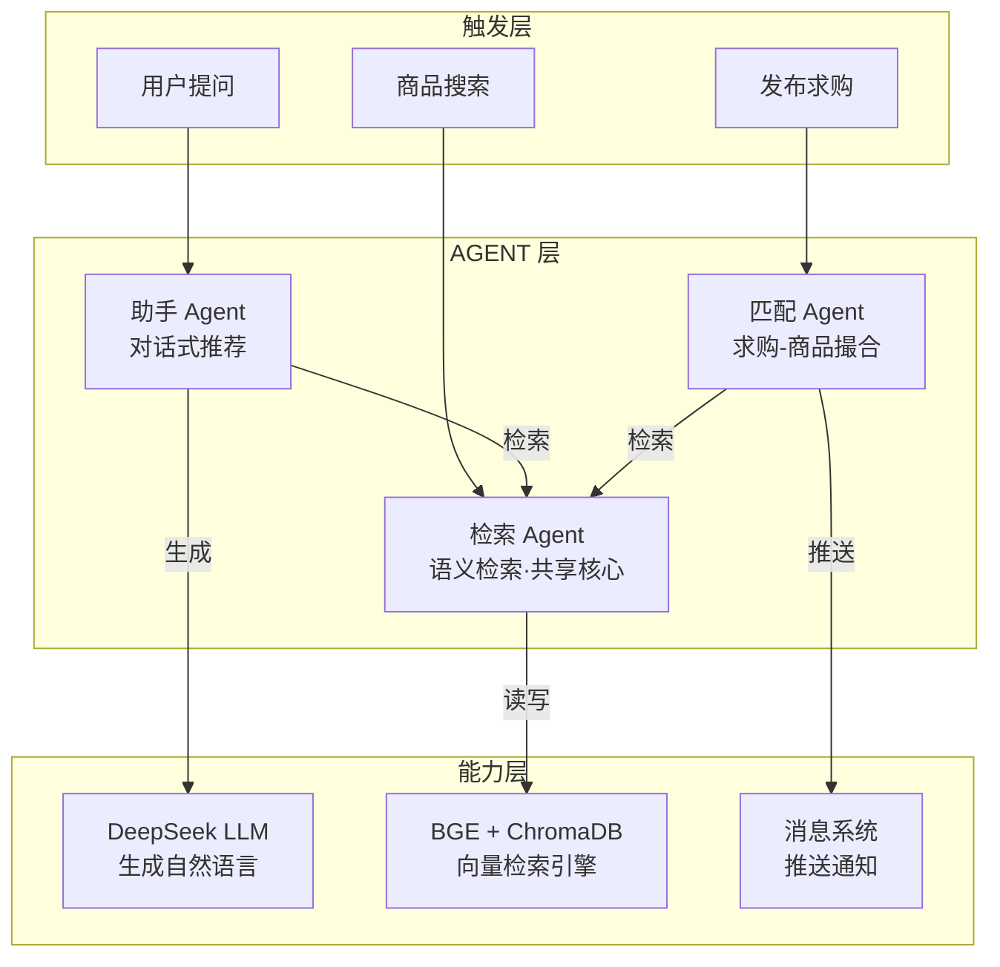
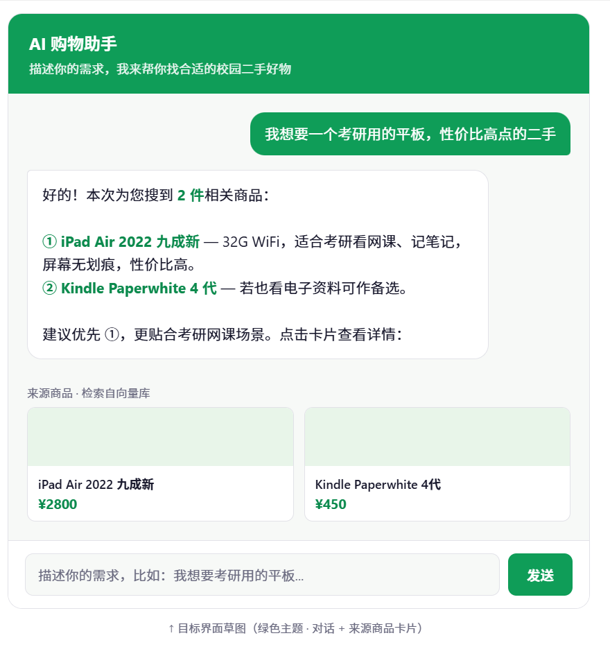
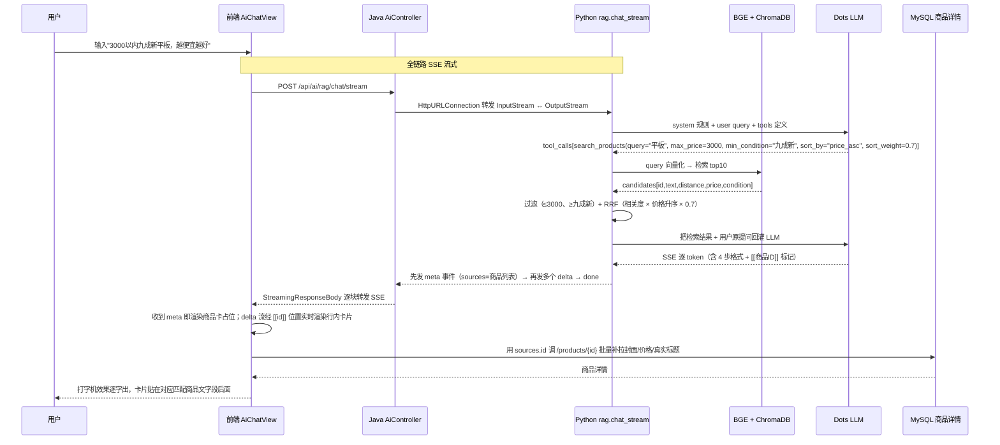

# 校园二手交易平台 · 功能概述

> 本文档用于梳理项目现状、待修改部分、规划扩充功能与技术栈，作为后续「智能 Agent 化」包装工作的依据。

---

## 一、项目现状

### 1.1 技术栈（现有）

**后端**：Spring Boot 3.3.5 + MyBatis-Plus 3.5.7 + Flyway 10 + Spring Security + JWT (jjwt 0.12.6) + WebSocket + Redis + Spring Mail + 阿里云 OSS + SpringDoc OpenAPI

**前端**：Vue 3 + TypeScript + Element Plus + Vite + Pinia

**存储**：MySQL 8（业务数据）+ Redis（已配置但未充分使用）

### 1.2 已有功能模块

后端按业务模块划分，结构清晰：

| 模块 | 主要能力 |
|---|---|
| `user` | 学生注册/登录、邮箱验证码、密码重置、个人资料、每日签到（减碳积分）、信用体系 |
| `product` | 商品发布/编辑/下架、图片与附件上传、分类、分页查询（latest/hot） |
| `wanted` | 求购发布/编辑/关闭、「我有这个」入口 |
| `order` | 下单、买家取消/确认收货、卖家生成扫码确认令牌（24h）、双方评价 |
| `chat` | 会话管理、消息分页、未读标记；上下文类型：GENERAL / PRODUCT / WANTED |
| `community` | 帖子、评论树、点赞 |
| `report` | 举报、评价申诉 |
| `admin` | 仪表盘统计、用户封禁、积分调整 |
| `category` | 分类管理 |
| `file` | 文件上传、静态资源访问 |
| `ai` | **仅一个 DeepSeek 文案润色接口**，直接 HTTP 调用模型，无任何 agent 处理 |

### 1.3 AI 现状（已落地部分 + 待补短板）

**已完成的 AI 能力：**

| 能力 | 实现 | 状态 |
|---|---|---|
| 文案润色 | Java 转发 → Python FastAPI → LLM | ✅ 已通 |
| RAG 语义检索 | 本地 BGE-small-zh-v1.5（ONNX）+ ChromaDB | ✅ 已通 |
| 助手 Agent 对话页 | AiChatView.vue，绿色主题气泡 + 商品卡 + 流式打字机 | ✅ 已上线 |
| Function Calling（9 参数工具）| `search_products(query, min_price, max_price, min_condition, max_condition, keywords_exclude, category_hint, sort_by, sort_weight)` | ✅ 已上线 |
| RRF 融合排序 | `score = (1-sw)·1/(60 + rank_rel) + sw·1/(60 + rank_biz)` | ✅ 已上线 |
| 结构化回答 + 澄清 | 强制 4 步输出（需求/匹配/差异/建议）；不明确时反问用户 | ✅ 已上线 |
| 行内商品卡片 | 匹配商品 ①②③ 后紧跟对应商品卡，点击跳详情 | ✅ 已上线 |
| SSE 流式输出 | Python → Java → Vite 三层全链路，逐字打字机效果 | ✅ 已上线 |
| LLM 模型 | 小红书 Dots Studio（dots3-note-prev，`https://note3-prev-api.askdiandian.com`）| ✅ 已切换 |
| Java ↔ Python 联调 | HttpURLConnection 转发，失败降级演示模式 | ✅ 已通 |

**仍待补的短板：**

- 无 Memory（多轮对话上下文 + 指代消解），当前为单轮
- 检索向量库需二阶段 Rerank（"滑板"混瑜伽垫、"耳机"混显示器仍需 LLM 硬剔除）
- 匹配 Agent（求购撮合）未做
- 未使用 Redis 做会话记忆 / 缓存
- 商品发布/下架后未自动增量同步向量库

---

## 二、需要修改 / 规范化的部分

### 2.1 工程规范
- [ ] 现有 `BOOT-INF/`、`lib/`、编译产物混入仓库，应清理并完善 `.gitignore`
- [ ] 补充单元测试与集成测试覆盖（当前几乎为空）
- [ ] 统一异常处理与返回结构（已有 `ApiResponse` 与 `GlobalExceptionHandler`，需检查一致性）
- [ ] `application.yml` 中的敏感配置应全部走环境变量

### 2.2 聊天模块
- README 标注「聊天为 HTTP + 前端轮询（未接 WebSocket）」，但 pom 已引入 `spring-boot-starter-websocket` 并有 `WebSocketController`。需核实并统一为真正的 WebSocket 推送，替换轮询。

### 2.3 Redis 使用
- 依赖已引入但未实际利用。建议用于：验证码、登录限流、热门商品榜、Agent 会话短期记忆、接口缓存。

### 2.4 AI 模块重构
- 现有润色接口将迁入新的 Python AI 服务，Java 侧改为转发，保留 JWT 鉴权。

---

## 三、扩充功能规划

整体目标：把项目从「调用模型的 Web 应用」升级为「Java 业务主应用 + Python AI 服务的多智能体交易系统」，作为实习/考研复试的简历主项目。

### 3.0 三 Agent 协作架构（当前设计核心）

RAG 能力按「触发方式」和「用途」拆成三个 Agent，共享同一套 BGE 模型 + ChromaDB 向量库：

| Agent | 职责 | 触发方式 | 调用什么 | 状态 |
|---|---|---|---|---|
| **检索 Agent** | 语义检索商品/求购，按关联度返回 | 被其他 Agent 调用，也被搜索框直接调 | BGE + ChromaDB | ✅ 后端完成 |
| **助手 Agent** | 对话式推荐，生成带理由的回答 | 用户主动提问 | 调检索 Agent + Dots LLM | ✅ 已上线（单轮） |
| **匹配 Agent** | 主动撮合求购与在售商品，推消息给双方 | 发布求购时自动触发 | 调检索 Agent + 消息系统 | ❌ 未做 |

> **一句话关系**：检索 Agent 是眼睛（看商品库有什么相关的），助手 Agent 是嘴巴（看完用 LLM 说给人听），匹配 Agent 是红娘（看完主动把买卖双方拉到一起）。三者共用同一双眼睛，避免重复建库。

### 3.1 第一阶段：Python AI 服务 + RAG 检索（✅ 后端已完成）

**新建 `ai-service/`（Python FastAPI）**，实现智能导购 Agent：

- **能力**：
  - 自然语言理解需求（预算/成色/校区/品类）
  - RAG 语义检索商品库（理解「考研用」≈ 性能本/平板，超越关键词匹配）
  - Function Calling 调用 Java 现有接口作为工具
  - 推荐并给出理由（基于同类商品均价对比）
  - 多轮对话 Memory
  - 引导「联系卖家 / 查看详情」
- **边界**：不替用户下单、不编造商品、不透露卖家隐私、不做议价（议价留给第二阶段）
- **核心接口**：
  - `POST /agent/chat`（SSE 流式）
  - `POST /agent/search`（RAG 检索）
- **数据同步**：MySQL 商品表 → embedding → Chroma（先全量，后增量）

### 3.1.5 助手 Agent 对话页：智能购物助手（待开发）

> 3.0 架构中「助手 Agent」面向用户的前端落地。后端 `/api/ai/rag/chat` 已就绪，本节规划前端对话页。

**功能定位**：校园二手交易 AI 购物助手。用户用自然语言描述需求（如「我想要一个考研用的平板，性价比高的二手」），助手检索商品库 → 用自然语言给出推荐与理由 → 下方挂来源商品卡片，可点击跳详情。

**用户交互流程**：

1. 用户从导航进入「AI 助手」页，看到欢迎语 + 输入框
2. 输入需求，回车 / 点发送
3. 显示「AI 思考中...」加载态
4. AI 回复推荐话术（「本次为您搜到 2 件商品：① iPad... ② Kindle...，建议优先 ①...」）
5. 话术下方展示来源商品卡片（封面图 + 标题 + 价格）
6. 点击卡片跳转商品详情页
7. 第一版单轮问答，后续可扩展多轮上下文

**界面布局示意**：

> 风格沿用项目绿色主题（`#0f9d58`），气泡圆角，来源卡片与商品列表页风格一致。

**后端完整调用流程**：

**技术实现要点**（当前已落地）：

| 层 | 能力 | 说明 |
|---|---|---|
| 后端 Java | `/chat/stream` 流式转发 | 用 InputStream↔OutputStream 字节流直转，不攒完整 body；失败降级演示模式 |
| 后端 Python | 9 参数工具 | `search_products(query, min_price, max_price, min_condition, max_condition, keywords_exclude, category_hint, sort_by, sort_weight)` |
| 后端 Python | RRF 融合排序 | 同时尊重向量相关度和用户价格/成色偏好，`sort_weight` 控制偏好权重（0~1） |
| 后端 Python | 系统 Prompt | 参数判断规则 + 4 类澄清规则 + 8 个 few-shot + 4 步输出强约束 + `[[商品ID]]` 行内标记 |
| 后端 Python | 两轮 LLM + 节流 | 第 1 轮等 tool_calls（必完整），第 2 轮 SSE + 22ms/token 节流（人眼舒适打字机） |
| 模型 | 小红书 Dots | `dots3-note-prev`，`api-key` 自定义头，512K 上下文 |
| 前端 Vue 3 | 整体替换引用响应式 | `messages[idx] = {...prev, content: newContent}` 解决增量赋值漏触发的 Vue 坑 |
| 前端 Vue 3 | 行内卡片 | `[[id]]` 任意位置解析为封面+标题+价格的横向小卡片，点击跳详情 |
| 前端 Vite | 代理禁缓冲 | `X-Accel-Buffering: no` + 删 `Content-Length`，避免 dev proxy 把 SSE 攒完 |

**已验证的端到端场景**：
1. 「我要个平板，3000以内，九成新以上」→ max_price + min_condition 双约束，仅返回 iPad Air 2800
2. 「平板，不要低于3000元的」→ min_price 约束，0 条，AI 正确建议放宽预算
3. 「滑板，不要长板那种」→ keywords_exclude=["长板"]，长板被排除
4. 「耳机，便宜点就行」→ sort_by=price_asc, sort_weight=0.5，模糊偏好只调排序不瞎编上限
5. 「给我推荐点好东西吧随便看看」→ 不调工具，AI 直接反问四类类目
6. 行内卡片位置正确，点击卡片跳商品详情，按返回键聊天记录保留（keep-alive）

**待补升级项**（最终目标 · 多轮对话版）：

| 升级项 | 说明 |
|---|---|
| 多轮对话 Memory | 保留上下文，支持"再便宜点的""那个多少钱"，并做 Query Rewrite 做指代消解 |
| 二阶段 Rerank | BGE-Reranker-v2-m3 精排，减少"滑板→瑜伽垫"类语义混淆 |
| 商品增量同步 | 商品发布/下架时自动灌/删向量库，不依赖手动调用接口 |
| 匹配 Agent | 发布求购后自动撮合在售商品，推送消息给买卖双方 |

### 3.2 第二阶段：多智能体协作（LangGraph 编排）

引入 **LangGraph** 作为多 Agent 编排框架，构建最小协作闭环：

- **导购 Agent**：找货、检索、推荐
- **议价 Agent**：参考同类均价 + 双方信用，在合理区间协助协商

协作链路示例：用户「找辆 200 以内的自行车，帮我砍到 180」→ 导购 Agent 检索候选 → 移交议价 Agent → 返回协商结果。

### 3.3 第三阶段：MCP Server 封装

将 Java 业务能力（查商品、查订单、发消息等）封装为标准 **MCP Server**，使任何 MCP 客户端均可复用，体现对 2025 主流 Agent 协议的掌握。

### 3.4 推荐算法

为商品列表增加个性化推荐：
- 协同过滤（基于用户行为）
- 内容召回（商品标签 + 向量相似度，复用 RAG 向量）
- 业务规则重排（信用、新鲜度、同城优先）
- 排序模型可选 LightGBM

### 3.5 其他扩充（按需）
- MongoDB 存储 Agent 对话历史与非结构化日志
- 管理后台 AI Copilot（Text2SQL 自然语言查数据）
- 发布助手 Agent（图片识别 + 文案 + 同类商品建议定价）
- 消息队列：下单后异步更新推荐、事件驱动

---

## 四、技术栈规划（扩充后）

### 4.1 后端（Java，业务主应用，保持不变并规范化）
- Spring Boot 3 + MyBatis-Plus + Flyway + Security + JWT + WebSocket
- Redis（缓存 / 限流 / 会话 / 验证码 / Agent 短期记忆）
- 阿里云 OSS、Spring Mail、SpringDoc OpenAPI

### 4.2 AI 服务（Python，已落地）
- **Web 框架**：FastAPI（异步、SSE 友好）
- **后续可升级**：LangGraph（多智能体协作，状态机 + 图结构）
- **LLM**：小红书 Dots Studio · dots3-note-prev（512K 上下文，`api-key` 头）
- **Embedding**：本地 BGE-small-zh-v1.5 ONNX + onnxruntime（零外部依赖，免费）
- **向量库**：Chroma（轻量、零运维、快速验证）
- **HTTP 客户端**：httpx（流式调用 LLM）

### 4.3 前端（Vue 3，少量扩展）
- 新增「AI 找货」入口
- 接入 SSE 流式对话渲染
- 推荐卡片组件（商品 + 推荐理由，可点击跳转）

### 4.4 数据层
| 存储 | 用途 |
|---|---|
| MySQL | 业务数据（不变） |
| Redis | 缓存、限流、会话、Agent 短期记忆 |
| Chroma | RAG 向量检索（商品 / 求购 / 帖子） |
| MongoDB（可选） | Agent 对话历史、非结构化日志 |

### 4.5 服务间通信
- 前端 → Java：REST（不变）
- 前端 → Python：SSE 流式（Agent 对话）
- Python ↔ Java：内网 REST（工具调用 + 结果返回），对前端透明
- Python → LLM / Embedding API：HTTPS

---

## 五、混合架构说明（Java + Python 协作）

核心思路：**Java 当业务主战场，Python 当 AI 副驾，两端用 HTTP 解耦**。

- Java 继续承担商品、订单、聊天、权限、事务——撑起「Java 工程能力」基本盘。
- Python 独立服务专注 agent 逻辑（LangGraph、RAG、MCP client、多 agent 编排），享受 Python 生态在 AI 领域的领先性。
- Python 通过 HTTP 调用 Java 暴露的内部工具接口；Java 把 `/api/ai/agent` 转发到 Python，复用现有 JWT 鉴权。
- 对前端透明，多语言混合微服务本身就是「按场景选技术」的体现。

---

## 六、简历主卖点（待深化）

**「基于 RAG + Function Calling 的校园二手交易智能导购 Agent」**，配「Java 业务主应用 + Python AI 服务」混合架构。

需准备被问：
- 为什么用 Python 做 AI、Java 做业务？
- 向量库与 Embedding 如何选型？
- RAG 召回率如何评估？
- Agent 如何防止乱调工具（边界约束）？
- 多智能体如何协作、状态如何在 agent 间传递？
